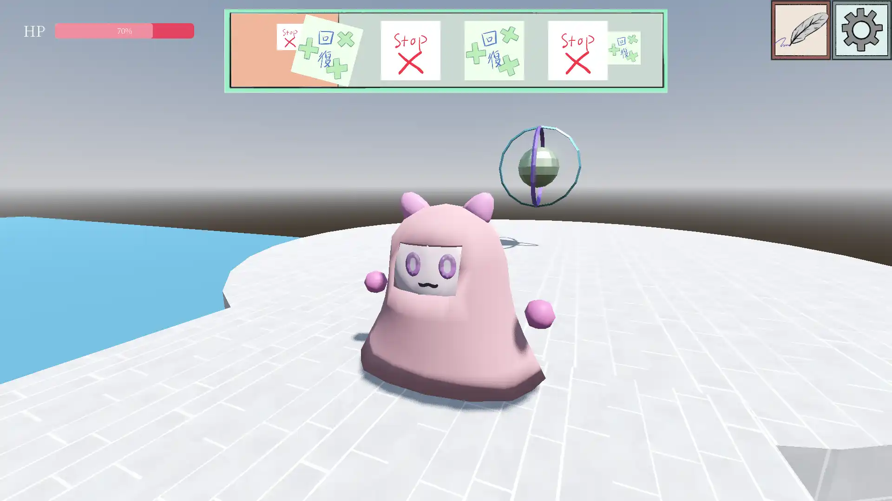
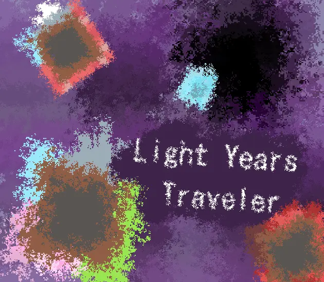
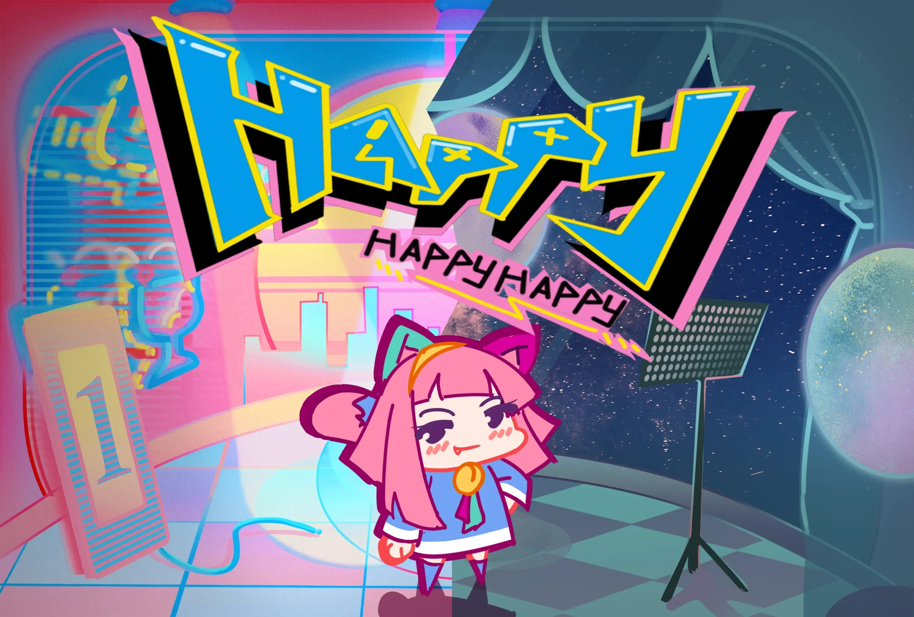

## もう

リリース日：2025年12月28日

Unity 一週間ゲームジャム お題「もうひとつ」の参加作です。

---

## 譜面の魔法使い

リリース日：2025年12月14日

「 Godotでゆるっとゲーム制作祭４」の参加作です。

---

## 終わりなき旅

リリース日：2024年12月27日

「Unity（中国）開発者コミュニティゲームジャム」の参加作です。

---

## 光年の旅人

リリース日：2024年7月21日

「 Godot Wild Jam #71 」の参加作です。

---

## 痕跡

リリース日：2023年10月11日

「BOOOMJAM（中国）」の参加作です。

---

## HappyHappyHappy

リリース日：2023年08月25日

「BOOOMJAM（中国）」の参加作です。

---

## 未完成のパズル

リリース日：2023年03月29日

「BOOOMJAM（中国）」の参加作です。
